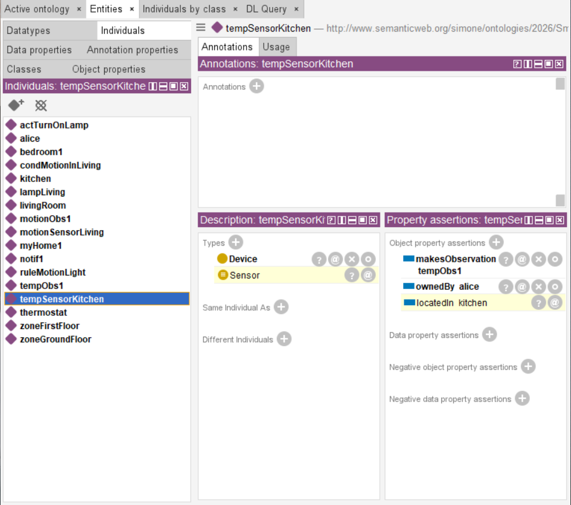
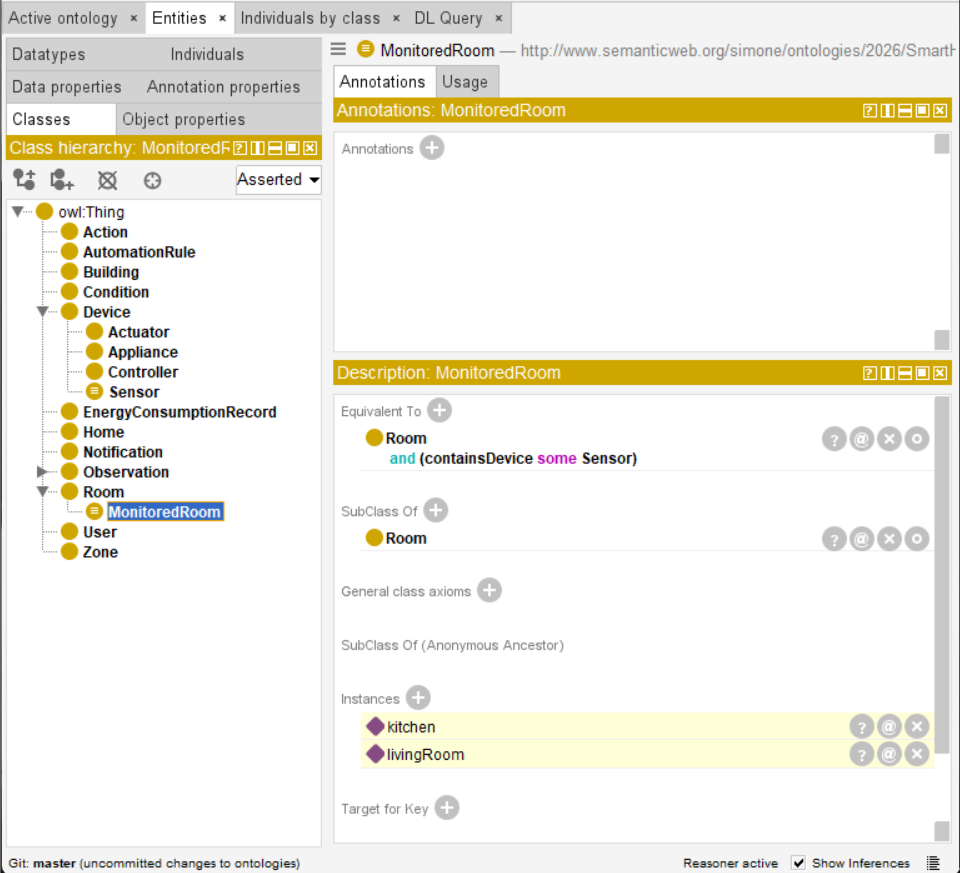

# Smart Home IoT Ontology (OWL 2 DL)

## Overview
OWL 2 DL ontology modeling smart home IoT: rooms, devices (sensors/actuators), observations, automation rules, users, notifications. Demonstrates equivalent classes, inverse properties, disjointness, functional constraints.

## Core Components

**Classes (20)**: `Home`, `Room`, `Zone`, `MonitoredRoom`(inferred), `Device`, `Sensor`(inferred), `Actuator`, `Controller`, `Appliance`, `Observation`(`TemperatureObservation`, `HumidityObservation`, `MotionObservation`), `EnergyConsumptionRecord`, `AutomationRule`, `Condition`, `Action`, `User`, `Notification`.

**Properties (46)**:  
**Object (31)**: `hasRoom`↔`isRoomOf`, `containsDevice`↔`locatedIn`, `makesObservation`↔`observedBy`, `ownedBy`↔`ownsDevice`, `hasRule`, `hasCondition`, `hasAction`, `actsOnDevice`, `receivesNotification`↔`sentToUser`, `generatedByRule`, `aboutRoom`, etc.  
**Data (15)**: `deviceId`(xsd:string), `hasValue`(xsd:decimal), `observedAt`(xsd:dateTime), `ruleName`(xsd:string), `messageText`(xsd:string), `isOnline`(xsd:boolean), etc.

**Logical Constraints**:
- `Sensor ≡ Device ⊓ ∃makesObservation.Observation`
- `MonitoredRoom ≡ Room ⊓ ∃containsDevice.Sensor`
- `Device ⊓ Room ⊑ ⊥`, `Device ⊓ User ⊑ ⊥`, `Observation ⊓ Device ⊑ ⊥`
- `Functional(ownedBy)`
- Inverses: `containsDevice`↔`locatedIn`, etc.

## Individuals (18)
`myHome1`(Home), `kitchen/livingRoom/bedroom1`(Room, kitchen/livingRoom→MonitoredRoom), `zoneGroundFloor/zoneFirstFloor`(Zone), `tempSensorKitchen/motionSensorLiving`(Device→Sensor), `lampLiving`(Actuator), `thermostat`(Controller), `tempObs1/motionObs1`(Observation), `ruleMotionLight/condMotionInLiving/actTurnOnLamp`(Automation), `alice`(User), `notif1`(Notification).

## Competency Questions
1. Monitored rooms? → `kitchen`, `livingRoom` (inferred)
2. Sensors? → `tempSensorKitchen`, `motionSensorLiving` (inferred)
3. Automation rules? → `ruleMotionLight`: "Turn on living room lamp..."
4. Device owners? → `alice ownsDevice tempSensorKitchen`
5. Notifications? → `notif1` by `ruleMotionLight`
6. Device location? → `tempSensorKitchen locatedIn kitchen` (inverse)

## Testing (HermiT)
1. Open `smarthome.owl`
2. Reasoner→HermiT→Start
3. **Inferences**: `tempSensorKitchen`→`Sensor`, `kitchen`→`MonitoredRoom`, `locatedIn kitchen` (inverse)

**OWL 2 DL ✓ Consistent ✓ Protégé 5.5+**

---
**Simone Dario** - simone.dario@studenti.univr.it